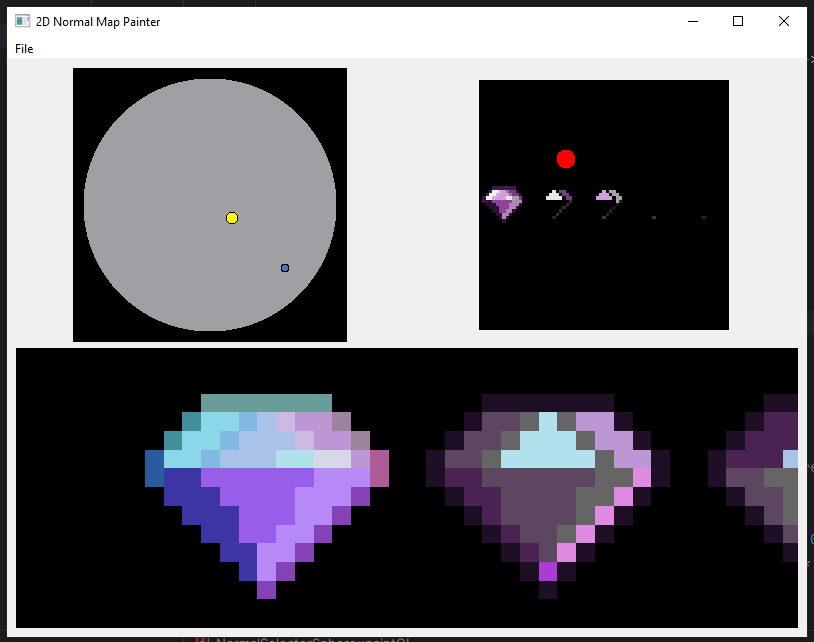

# 🎨 2D Normal Map Painter

A Qt-based desktop application for painting **2D normal maps**. This tool allows users to **paint normal maps on top of an image**, visualize normal directions in real-time using a **3D sphere**, and export the results. This is still under development.

<div style="width: 100%; justify-content: center; display: flex; padding: 10px">
   
</div>

## ✨ Features
- Load and display an image as a painting reference.
- Paint **normal maps** with customizable brush directions.
- Real-time **3D normal visualization** using a spherical interface.
- Scale the painting canvas to match the loaded image.
- Sample existing normals by hovering over painted pixels.

## 🛠️ Built With
- **C++**
- **Qt6 (Widgets, OpenGL)**
- **CMake**
- **GLM** (for 3D math)

## 🚀 Getting Started

### Prerequisites
Ensure you have the following installed:
- **Qt6 SDK** (Install via Qt Installer: [Qt Downloads](https://www.qt.io/download))
- **CMake** (`>= 3.10`)
- **A C++17-compatible compiler** (MinGW-w64, MSVC, or Clang)
- **GLM Library** (Install via package manager or manually)

### 🛠️ Building the Project
1. Clone the repository:
   ```bash
   git clone https://github.com/your-username/2d-normal-map-painter.git
   cd 2d-normal-map-painter
   ```
2. Configure and build using CMake:
   ```bash
   mkdir build && cd build
   cmake ..
   cmake --build .
   ```
3. Run the application:
   ```bash
   ./2d_normal_map_painter
   ```
----
> Optionally, you can use an **IDE** like **CLion**. Just make sure the Makefile is pointing to the correct Qt6 directory on your computer.

## 🖥️ Usage
1. **Load an Image**: Click `File > Open Image` to select a base texture.
2. **Paint Normals**: Click and drag to paint normal values on the canvas.
3. **Sample Normals**: Hover over painted pixels to view normals on the sphere.
4. **Adjust Scale**: Resize the image and canvas dynamically.

## 🏗️ Contributing
Contributions are welcome! To get started:
1. **Fork the repository**.
2. **Create a feature branch** (`git checkout -b feature-name`).
3. **Make your changes** and commit (`git commit -m "Description of change"`).
4. **Push to your branch** (`git push origin feature-name`).
5. **Create a pull request** and describe your changes.

### 🔧 Development Roadmap
- [ ] Scale / Pan an image with the mouse wheel.
- [ ] 
- [ ] Implement **brush size adjustments**.
- [ ] Add **export functionality** for normal maps.
- [ ] Improve **performance optimizations**.
- [ ] Implement **undo/redo support**.

## 📝 License
This project is licensed under the **MIT License**.

---

### 🛠️ Need Help?
For any questions or issues, feel free to open an **issue** in the repository.

---

🔗 **Happy coding!** 🚀
